# How to Run a Verifier Node

## Background

ZK verifier nodes are one of the critical roles in Cysic Network. Their job is to verify the ZK proofs generated by the Prover Node, and obtain Cysic Network credits as the rewards. Operating a verifier node requires minimum understand of the DeeOps and requirement on the hardware.

## Connect to Wallet

1. Go to the Cysic Phase3 [Website](https://testnet-pre.prover.xyz/m): [https://cysic.xyz/zk](https://cysic.xyz/zk)
2.  Join Testnet Phase 3

    <figure><figcaption></figcaption></figure>
3.  Connect to your wallet

    <figure><figcaption></figcaption></figure>

    <figure><figcaption></figcaption></figure>

    <figure><figcaption></figcaption></figure>
4.  Sign a message

    <figure><figcaption></figcaption></figure>

    <figure><figcaption></figcaption></figure>
5.  Enter the invite code

    <figure><figcaption></figcaption></figure>

    <figure><figcaption></figcaption></figure>
6.  Copy the address from your wallet. It will be used as reward address when starting the verifier.

    <figure><figcaption></figcaption></figure>

## Running the scripts

### Linux

#### TL;DR

> Open the terminal and run the following commands to setup and execute the verifier program

```bash
# replace 0x-Fill-in-your-reward-address-here with your reward address below
curl -L https://github.com/cysic-labs/cysic-phase3/releases/download/v1.0.0/setup_linux.sh > ~/setup_linux.sh && bash ~/setup_linux.sh 0x-Fill-in-your-reward-address-here

cd ~/cysic-verifier/ && bash start.sh
```

#### Detailed steps to execute verifier on Linux

1.  First start your terminal program on Linux. The shortcut is `Ctrl-Alt-T` on Ubuntu.

    <figure>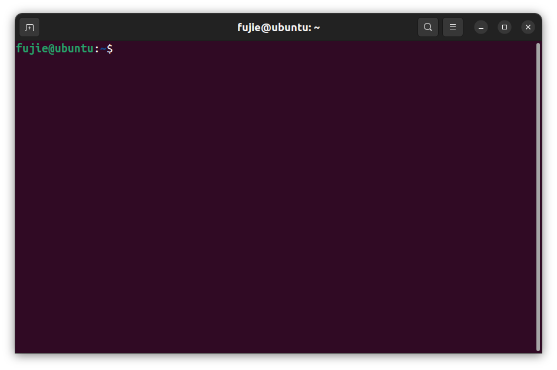<figcaption></figcaption></figure>

    \
    Or you can search for it in the applications and click on Terminal to start it.

    <figure>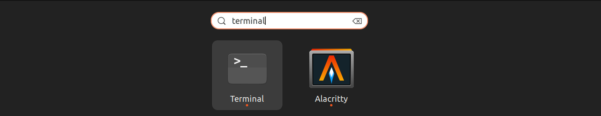<figcaption></figcaption></figure>
2.  Use the following command in the terminal to download and run the setup script( copy and paste the following command in terminal and press enter to run them). Please replace 0x-Fill-in-your-reward-address-here with your own reward address below.

    ```
    #replace 0x-Fill-in-your-reward-address-here to your reward address below
    curl -L https://github.com/cysic-labs/cysic-phase3/releases/download/v1.0.0/setup_linux.sh > ~/setup_linux.sh && bash ~/setup_linux.sh 0x-Fill-in-your-reward-address-here
    ```
3.  This script will do the following job:

    1. Download the verifier program and library: `verifier` & `libdarwin_verifier.so` & libdarwin\_verifier & `librsp.so`
    2. Create the verifier config file named `config.toml`
    3. Create script to run the verifier `start.sh`\


    You can go to `~/cysic-verifier` folder to see all the above contents created successfully after running the script.

    <figure>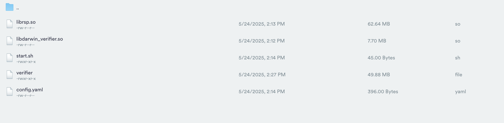<figcaption></figcaption></figure>
4. **Finish start the verifier program, use the following command in terminal to start the verifier program**

```bash
  cd ~/cysic-verifier/ && bash start.sh
```

.png>)

> The verifier may need some minutes to connect to the chain. When you see output like `send heartbeat to server`, then the verifier is running successfully.

> The verifier program will create mnemonic files for you. Your submitted address mnemonic file is in: `~/.cysic/keys/` folder, please keep it or you can not run the verifier program again.

### MacOS

#### TL;DR

Open the terminal and run the following commands to setup and execute the verifier program

```bash
# replace 0x-Fill-in-your-reward-address-here with your reward address below

curl -L https://github.com/cysic-labs/cysic-phase3/releases/download/v1.0.0/setup_mac.sh > ~/setup_mac.sh && bash ~/setup_mac.sh 0x-Fill-in-your-reward-address-here

cd ~/cysic-verifier/ && bash start.sh
```

#### Detailed steps to execute verifier on MacOS

1.  First start your terminal program on MacOS. Search for it in the applications and click on Terminal to start it.

    <figure>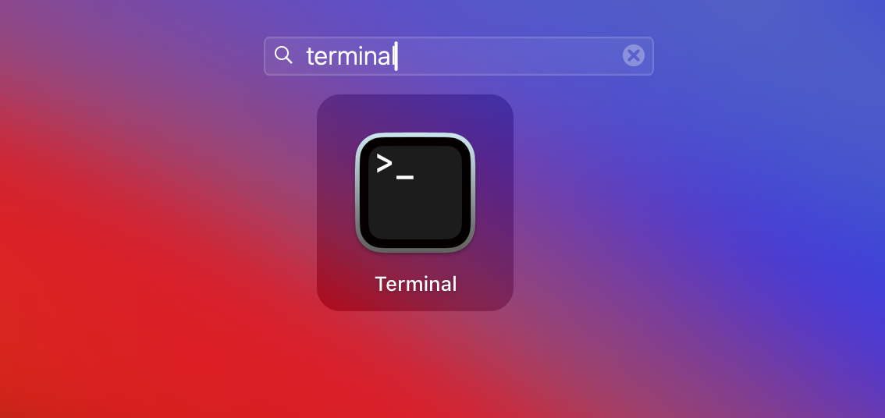<figcaption></figcaption></figure>
2.  Use the following command in the terminal to download and run the setup script (copy and paste the following command in terminal and press enter to run them). Please replace the 0x-Fill-in-your-reward-address-here with your own reward address.

    ```bash
    # replace 0x-Fill-in-your-reward-address-here with your reward address

    curl -L https://github.com/cysic-labs/cysic-phase3/releases/download/v1.0.0/setup_mac.sh > ~/setup_mac.sh && bash ~/setup_mac.sh 0x-Fill-in-your-reward-address-here
    ```

    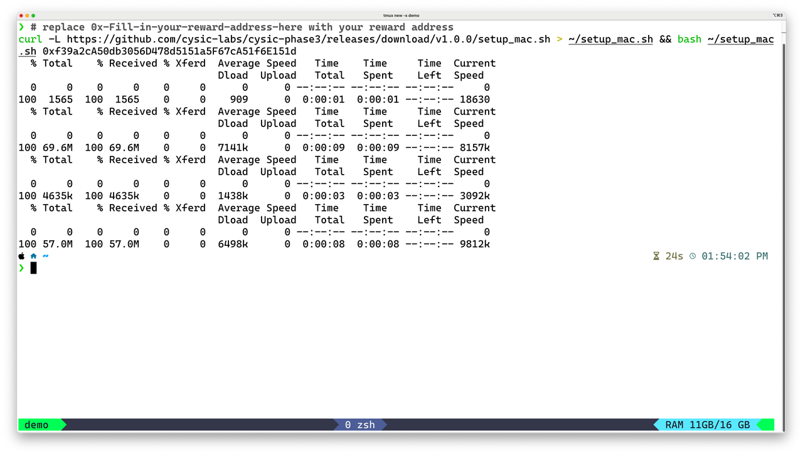
3. This script will do the following job:
   * Download the verifier program and library: verifier\_mac & libzkp.dylib & librsp.dylib
   * Create the verifier config file named config.toml
   *   Create script to run the verifier start.sh\
       You can go to \~/cysic-verifier folder to see all the above contents created successfully after running the script.

       <figure>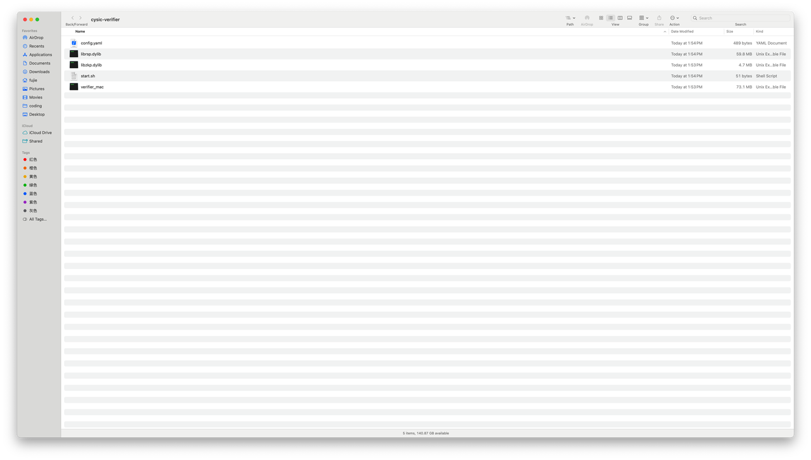<figcaption></figcaption></figure>
4. **Use the following command in terminal to start the verifier program:**

```bash
cd ~/cysic-verifier/ && bash start.sh
```

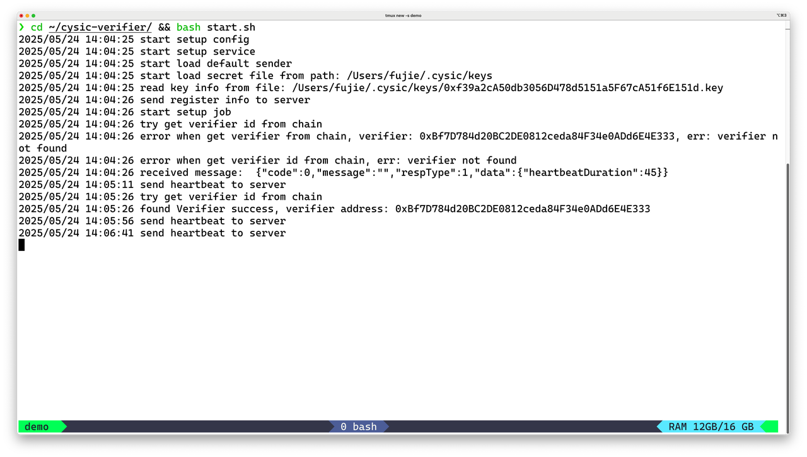

> The verifier may need some minutes to connect to the chain. When you see output like `send heartbeat to server`, then the verifier is running successfully.

> The verifier program will create mnemonic files for you. Your submitted address mnemonic file is in: `~/.cysic/keys/` folder, please keep it or you can not run the verifier program again.

### Windows

#### TL;DR

Open Windows Powershell and run the following commands to setup and execute the verifier program

```bash
# replace 0x-Fill-in-your-reward-address-here with your reward address below

cd $env:USERPROFILE
Invoke-WebRequest -Uri "https://github.com/cysic-labs/cysic-phase3/releases/download/v1.0.0/setup.ps1" -OutFile "setup_win.ps1"
.\setup_win.ps1 -CLAIM_REWARD_ADDRESS "0x-Fill-in-your-reward-address-here"

# run the verifier

cd $env:USERPROFILE\cysic-verifier
.\start.ps1
```

#### Detailed steps to execute verifier on Windows

1.  First start your terminal program on Windows. Search for it in the applications and start Powershell as administrator.

    <figure>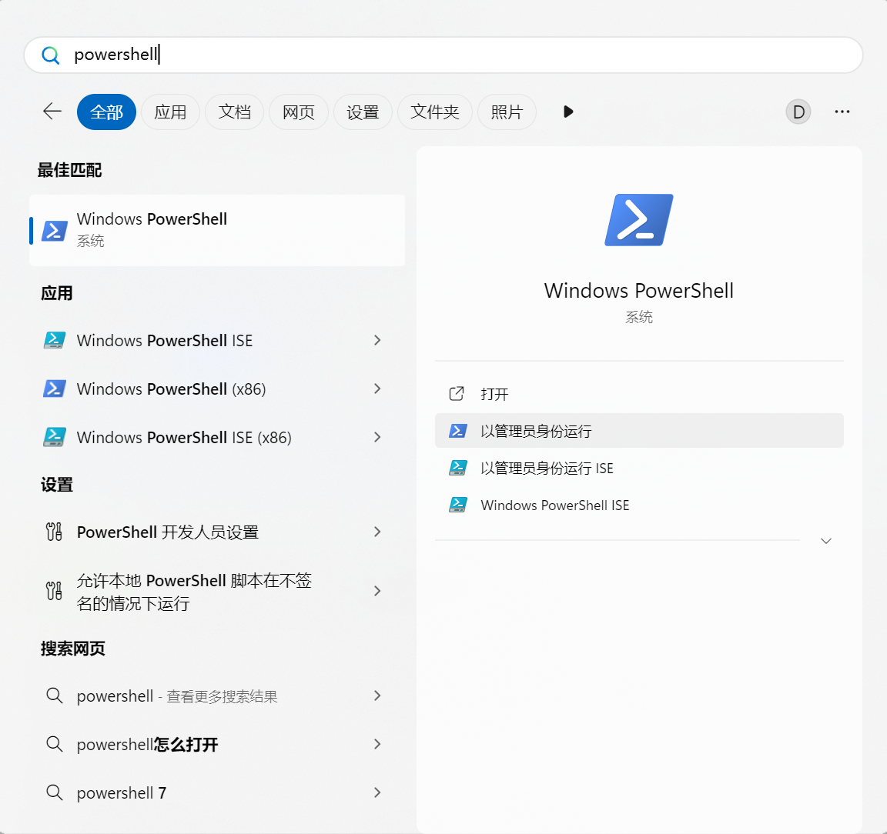<figcaption></figcaption></figure>
2.  Use the following command in the terminal to download and run the setup script (copy and paste the following command in Powershell and press enter to run them). Please replace 0x-Fill-in-your-reward-address-here with your own reward address below.

    ```bash
    # replace 0x-Fill-in-your-reward-address-here with your reward address below

    cd $env:USERPROFILE
    Invoke-WebRequest -Uri "https://github.com/cysic-labs/cysic-phase3/releases/download/v1.0.0/setup.ps1" -OutFile "setup_win.ps1"
    .\setup_win.ps1 -CLAIM_REWARD_ADDRESS "0x-Fill-in-your-reward-address-here"
    ```

    <figure>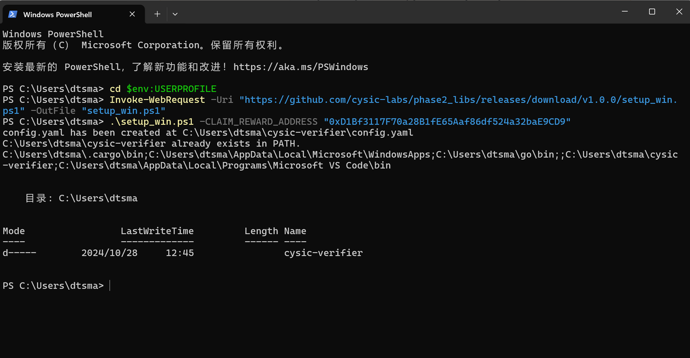<figcaption></figcaption></figure>
3. This script will do the following job:
   * Download the verifier program and library: verifier.exe, start.ps1 & zkp.dll
   * Create the verifier config file named config.toml
   *   Update Path variable to add cysic-verifier

       <figure>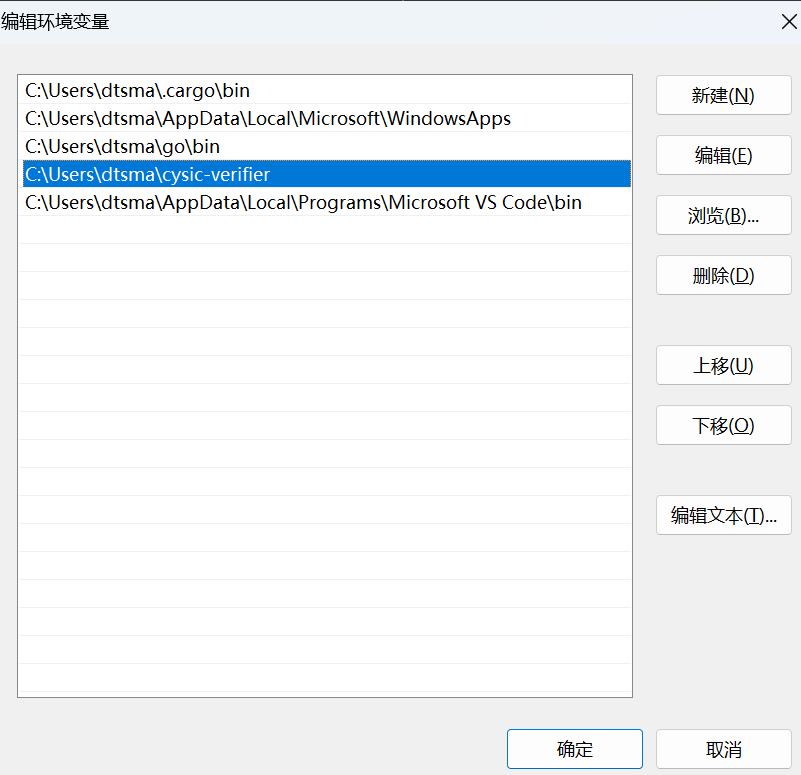<figcaption></figcaption></figure>
   *   You can go to `~/cysic-verifier` folder to see all the above contents created successfully after running the script.

       <figure>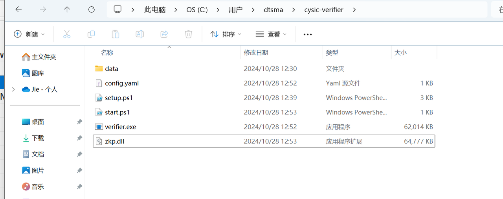<figcaption></figcaption></figure>
4. **Finish start the verifier program, use the following command in terminal to start the verifier program:**

```bash
# run the verifier

cd $env:USERPROFILE\cysic-verifier
.\start.ps1
```

<figure>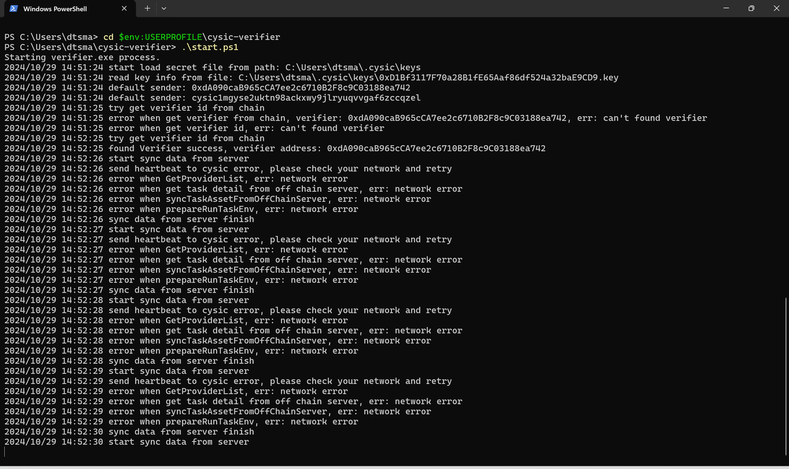<figcaption></figcaption></figure>

> The verifier may need some minutes to connect to the chain. When you see output like `send heartbeat to server`, then the verifier is running successfully.

> The verifier program will create mnemonic files for you. Your submitted address mnemonic file is in: `~/.cysic/keys/` folder, please keep it or you can not run the verifier program again.
