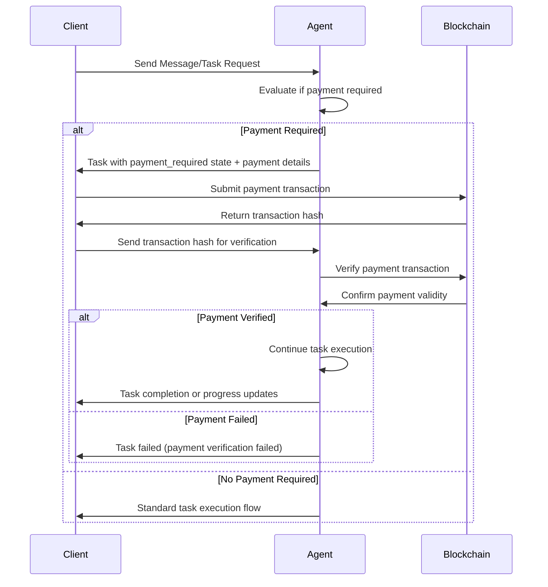

# Cysic Agent-to-Agent Protocol

## Overview

The Crypto A2A Protocol is an extension of Google's [Agent-to-Agent (A2A) Protocol](https://a2a-protocol.org/latest/topics/life-of-a-task/) that introduces cryptocurrency payment capabilities for agent tasks. By adding a new `payment_required` task state, this protocol enables agents to request payments from clients before proceeding with task execution, laying the foundation for an **Agent Economy Ecosystem**.

This extension maintains full compatibility with the standard A2A Protocol while introducing Web3 payment functionality, allowing agents to monetize their services through blockchain-based transactions.

**Current Implementation**: The initial version focuses on **Solana blockchain integration**, supporting SOL and SPL token payments. Future versions will extend support to additional blockchain networks.

## Key Concepts

### Extended Task States

The Crypto A2A Protocol extends the original A2A task states with an intermediate state:

* **`payment_required`**: A new intermediate state indicating that the agent requires payment before continuing task execution

This state works alongside existing A2A states such as `input_required`, `auth_required`, `working`, `completed`, `failed`, etc.

### Payment Flow Integration

When an agent determines that a task requires payment, it transitions to the `payment_required` state and provides payment details to the client. The task remains in an interrupted state until the client:

1. Processes the payment transaction on the blockchain
2. Provides the transaction hash as verification
3. The agent verifies the payment on-chain
4. The task continues to execution upon successful verification

### Lifespan of a Paid Task

The following diagram illustrates the extended lifecycle of a task that requires payment (using Solana blockchain as an example):



### Protocol Extensions

#### Payment Details Structure

When an agent requests payment, it includes structured payment information. The current implementation supports **Solana-based payments**:

```json
{
  "amount": "10.50",
  "token_name": "USDC",
  "network": "mainnet-beta",
  "recipient_address": "7xKXtg2CW87d97TXJSDpbD5jBkheTqA83TZRuJosgAsU",
  "token_mint_id": "EPjFWdd5AufqSSqeM2qN1xzybapC8G4wEGGkZwyTDt1v",
  "description": "Payment for AI image generation service"
}
```

#### Extended Task Status

The task status is enhanced to include payment information:

```json
{
  "state": "payment_required",
  "message": "Payment of 10.50 USDC required to continue",
  "payment_details": {
    "amount": "10.50",
    "token_name": "USDC",
    "network": "mainnet-beta",
    "recipient_address": "7xKXtg2CW87d97TXJSDpbD5jBkheTqA83TZRuJosgAsU",
    "token_mint_id": "EPjFWdd5AufqSSqeM2qN1xzybapC8G4wEGGkZwyTDt1v"
  }
}
```

### Example Payment Flow (Multiturn Conversation)

Similar to how the standard A2A protocol handles `input_required` states, the `payment_required` state enables a multiturn conversation flow where the client can continue the same task after completing the payment.

**Note**: The following examples demonstrate the payment workflow using **Solana blockchain** and **USDC SPL tokens**.

#### 1. Initial Request - Client Sends Message

```python
# First message in the conversation
send_message_payload = {
    'message': {
        'role': 'user',
        'parts': [
            {
                'kind': 'text', 
                'text': 'Generate a high-quality logo for my startup'
            }
        ],
        'message_id': uuid4().hex,
    },
}

request = SendMessageRequest(
    id=str(uuid4()), 
    params=MessageSendParams(**send_message_payload)
)

response = await client.send_message(request)
```

**Server Response - Payment Required:**

```json
{
  "jsonrpc": "2.0",
  "id": "req-001",
  "result": {
    "id": "task-logo-gen-123",
    "context_id": "ctx-conversation-abc",
    "status": {
      "state": "payment_required",
      "message": "Payment of 25.00 USDC required for premium logo generation",
      "payment_details": {
        "amount": "25.00",
        "token_name": "USDC",
        "network": "mainnet-beta",
        "recipient_address": "7xKXtg2CW87d97TXJSDpbD5jBkheTqA83TZRuJosgAsU",
        "token_mint_id": "EPjFWdd5AufqSSqeM2qN1xzybapC8G4wEGGkZwyTDt1v",
        "description": "Premium logo generation service"
      }
    },
    "kind": "task"
  }
}
```

#### 2. Extract Task Information and Process Payment

```python
# Extract task_id and context_id from the response
task_id = response.root.result.id  # "task-logo-gen-123"
context_id = response.root.result.context_id  # "ctx-conversation-abc"
payment_details = response.root.result.status.payment_details

# Client processes the payment (implementation depends on payment handler)
transaction_hash = await process_payment(payment_details)
# Returns something like: "3x7KmFp9QR8vN2Lj6WsD4eT1qH9mB5cX8pY2nU7oS6k"
```

#### 3. Continue Task with Payment Verification

```python
# Second message with payment verification - uses same task_id and context_id
payment_verification_payload = {
    'message': {
        'role': 'user',
        'parts': [
            {
                'kind': 'text',
                'text': f'Payment transaction hash: {transaction_hash}'
            }
        ],
        'message_id': uuid4().hex,
        'task_id': task_id,  # Continue the same task
        'context_id': context_id,  # Same conversation context
    },
}

payment_request = SendMessageRequest(
    id=str(uuid4()),
    params=MessageSendParams(**payment_verification_payload),
)

payment_response = await client.send_message(payment_request)
```

**Server Response - Payment Verified, Task Continues:**

```json
{
  "jsonrpc": "2.0",
  "id": "req-002",
  "result": {
    "id": "task-logo-gen-123",
    "context_id": "ctx-conversation-abc",
    "status": {
      "state": "working",
      "message": "Payment verified, generating your premium logo..."
    },
    "kind": "task"
  }
}
```

#### 4. Task Completion with Artifacts

**Final Server Response - Task Completed:**

```json
{
  "jsonrpc": "2.0",
  "id": "task-update-001",
  "result": {
    "id": "task-logo-gen-123",
    "context_id": "ctx-conversation-abc",
    "status": {
      "state": "completed",
      "message": "Logo generation completed successfully"
    },
    "artifacts": [
      {
        "artifact_id": "artifact-logo-premium-xyz",
        "name": "startup_logo.png",
        "description": "High-quality startup logo design",
        "parts": [
          {
            "kind": "file",
            "file": {
              "name": "startup_logo.png",
              "mime_type": "image/png",
              "bytes": "<base64_encoded_logo_data>"
            }
          }
        ]
      }
    ],
    "kind": "task"
  }
}
```

#### 5. Automated Payment Handling with CryptoA2AClient

The Crypto A2A SDK provides automated payment handling to simplify this flow:

```python
from crypto_a2a import CryptoA2AClient

# Initialize client with payment capabilities
crypto_client = CryptoA2AClient(
    httpx_client=httpx_client, 
    agent_card=agent_card
)

# This method automatically handles payment_required states
response = await crypto_client.send_message_with_payment_handling(
    message="Generate a high-quality logo for my startup",
    payment_handler=my_custom_payment_handler  # Optional
)

# If payment was required, it's handled automatically
# The response will be the final task completion
print(response.artifacts[0].name)  # "startup_logo.png"
```

#### Key Points About Multiturn Payment Flow

1. **State Continuity**: The same `task_id` and `context_id` are used throughout the payment flow
2. **Interruption Model**: Similar to `input_required`, `payment_required` pauses task execution
3. **Verification Step**: The client must provide transaction proof to continue
4. **Automatic Resumption**: Once payment is verified, the task automatically continues
5. **Error Handling**: Failed payment verification transitions the task to `failed` state

## Architecture Components

### Agent-Side Components

1. **PaymentAgentExecutor**: Provides payment request and verification capabilities for agents
2. **Payment State Management**: Tracks payment requirements and verification status for each task
3. **Blockchain Verification**: Integrates with blockchain networks (Solana) to verify payment transactions

### Client-Side Components

1. **CryptoA2AClient**: Extended A2A client with payment handling capabilities
2. **Payment Handlers**: Pluggable payment processors for different token types and blockchains
3. **Automatic Payment Flow**: Seamless handling of payment requests during task execution

### Blockchain Integration

1. **Solana Network Support**: Currently supports Solana blockchain networks (mainnet-beta, devnet, testnet)
2. **SPL Token Flexibility**: Handles various Solana SPL tokens (SOL, USDC, USDT, custom SPL tokens)
3. **On-Chain Verification**: Solana transaction verification for secure payment confirmation

## Benefits and Use Cases

#### For Agent Developers

* **Monetization**: Direct revenue generation from agent services
* **Flexible Pricing**: Dynamic pricing based on task complexity or resource usage
* **Secure Payments**: Blockchain-based payment verification eliminates chargebacks

#### For Agent Users

* **Pay-per-Use**: Only pay for services actually consumed
* **Transparent Pricing**: Clear payment requirements before task execution
* **Decentralized**: No intermediary payment processors required

#### AgentFi Ecosystem

* **Agent Marketplace**: Enables decentralized marketplaces for AI agent services
* **Service Discovery**: Agents can advertise their capabilities and pricing
* **Cross-Agent Payments**: Agents can pay other agents for sub-tasks or collaboration

## Implementation Considerations

#### Security

* All payment verification occurs on Solana blockchain for maximum security
* Transaction hashes are verified against the exact payment requirements
* Failed verification immediately halts task execution

#### Performance

* Payment verification is asynchronous and doesn't block other operations
* Configurable timeout and retry mechanisms for payment processing
* Minimal impact on standard A2A protocol performance

#### Compatibility

* Maintains full backward compatibility with standard A2A protocol
* Existing A2A agents continue to work without modification
* Payment features are opt-in and can be selectively enabled

## Future Extensions

The Crypto A2A Protocol provides a foundation for advanced AgentFi features:

* **Multi-blockchain Support**: Extension from current Solana support to Ethereum, Bitcoin, and other blockchain networks
* **Advanced Payment Models**: Subscription payments, usage-based billing, revenue sharing
* **Agent-to-Agent Economy**: Direct agent collaboration with automated payments
* **Governance Tokens**: Community governance for agent marketplaces and protocols

**Roadmap Note**: While the current implementation focuses on Solana blockchain, the protocol design is blockchain-agnostic and can be extended to support multiple blockchain networks in future versions.

### Conclusion

The Crypto A2A Protocol represents a significant step toward the AgentFi ecosystem, where AI agents can operate as autonomous economic entities. By seamlessly integrating cryptocurrency payments into the A2A protocol, we enable new business models and use cases that were not possible with traditional payment systems.

This protocol maintains the simplicity and elegance of the original A2A specification while opening up entirely new possibilities for agent monetization and cross-agent collaboration in a decentralized economy.
