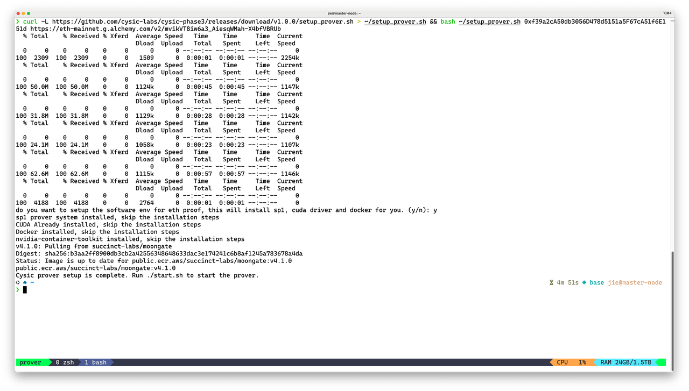
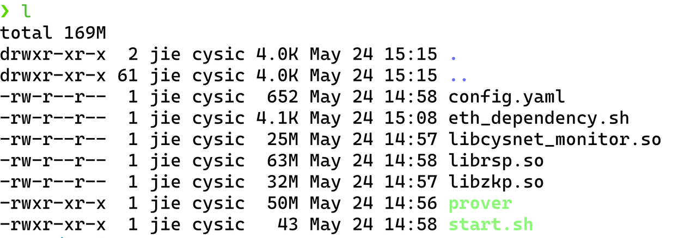
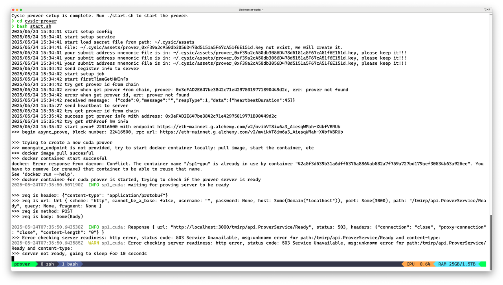

# How to Run a Prover Node

## Background

ZK prover nodes are one of the critical roles in Cysic Network. Their job is to generate ZK proofs of various kinds, assigned by our partners and obtain Cysic Network credits as the rewards. Operating a prover node requires a solid understanding of DevOps and high-performance hardware.&#x20;

## Hardware Requirements

1. Scroll Proof: One Ubuntu server with at least 256GB System RAM, 32 cores CPU, and a GPU with at least 20GB memory.
2. ETH Proof: One ubuntu server with at least 32GB System RAM, 8 cores CPU and a GPU with at least 16GB memory

## Connect to Wallet

1. Go to the Cysic Phase3 [Website](https://cysic.xyz/): [https://cysic.xyz/zk](https://cysic.xyz/zk)
2.  Join Testnet Phase 3

    <figure><figcaption></figcaption></figure>
3.  Connect to your wallet

    <figure><figcaption></figcaption></figure>

    <figure><figcaption></figcaption></figure>

    <figure><figcaption></figcaption></figure>
4.  Sign a message

    <figure><figcaption></figcaption></figure>

    <figure><figcaption></figcaption></figure>
5.  Enter the invite code

    <figure><figcaption></figcaption></figure>

    <figure><figcaption></figcaption></figure>
6.  Copy the address from your wallet. It will be used as reward address when starting the verifier.

    <figure><figcaption></figcaption></figure>

## Get Free RPC endpoint used by eth proof

1.  Go the [Alchemy](https://www.alchemy.com/) website to register a free RPC endpoint, sign in or register

    <figure><figcaption></figcaption></figure>
2.  Create a new app

    <div><figure><figcaption></figcaption></figure> <figure><figcaption></figcaption></figure> <figure><figcaption></figcaption></figure> <figure><figcaption></figcaption></figure></div>
3.  Got the RPC URL：copy the url

    <figure><figcaption></figcaption></figure>

## Running the scripts

### TL;DR

> Open the terminal and run the following commands to setup and execute the prover program

```bash
# replace 0x-Fill-in-your-reward-address-here to your reward address below

curl -L https://github.com/cysic-labs/cysic-phase3/releases/download/v1.0.0/setup_prover.sh > ~/setup_prover.sh && bash ~/setup_prover.sh 0x-Fill-in-your-reward-address-here Your_RPC_URL

cd ~/cysic-prover/ && bash start.sh
```

### Detailed steps to execute prover on Linux

1.  Download the setup script and run the setup script.

    * First start your terminal program on Linux. The shortcut is Ctrl-Alt-T on Ubuntu.\
      Or you can search for it in the applications and click on Terminal to start it.
    *   Use the following command in the terminal to download and run the setup script( copy and paste the following command in terminal and press enter to run them). Please replace 0x-Fill-in-your-reward-address-here with your own reward address below.

        ```bash
        # replace 0x-Fill-in-your-reward-address-here to your reward address below

        curl -L https://github.com/cysic-labs/cysic-phase3/releases/download/v1.0.0/setup_prover.sh > ~/setup_prover.sh && bash ~/setup_prover.sh 0x-Fill-in-your-reward-address-here Your_RPC_URL
        ```

        
    * This script will do the following job:
      1. Download the prover program and library: prover libcysnet\_monitor.so libdarwin\_prover.so & libzkp.so & eth\_dependency.sh
      2. Create the prover config file named config.toml
      3. Ask the user if you want to setup the eth\_proof software requirements, please choose y to allow the setup process if you want to run eth proof. 4. Create script to run the prover start.sh

    > You can go to \~/cysic-prover folder to see all the above contents created successfully after running the script.

    
2.  Finish start the prover program, use the following command in terminal to start the prover program

    ```bash
    cd ~/cysic-prover/ && bash start.sh
    ```

    

The prover may need some minutes to connect to the chain. When you see output like `send heartbeat to server`, then the prover is running successfully.

The prover program will create mnemonic files for you. Your submitted address mnemonic file is in: `～/.cysic/assets/` folder, please keep it or you can not run the prover program again.
