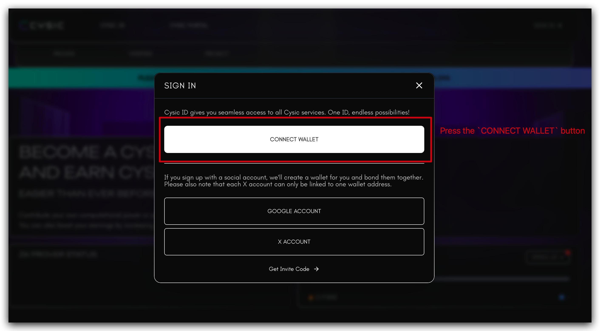
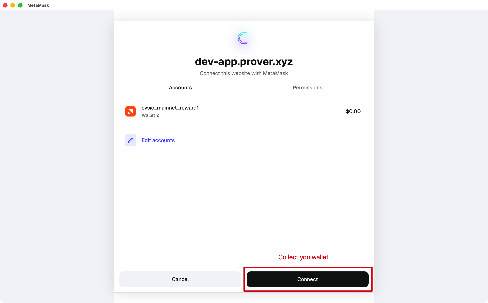
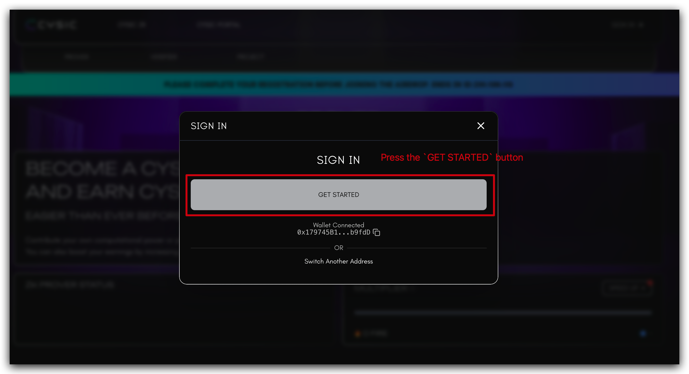
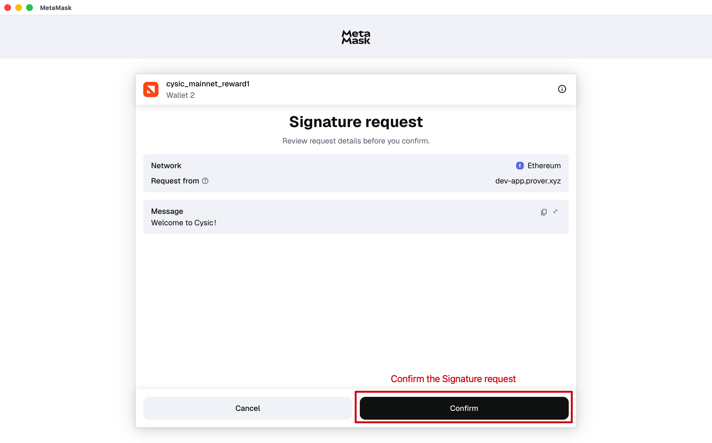
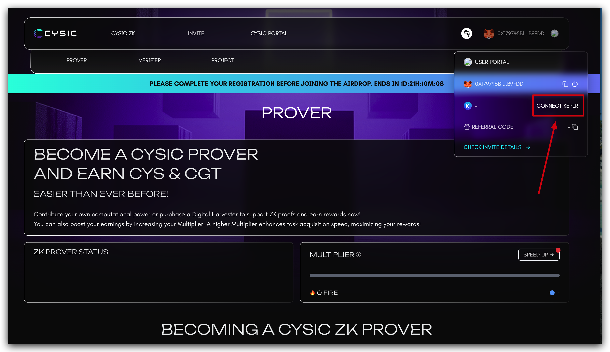
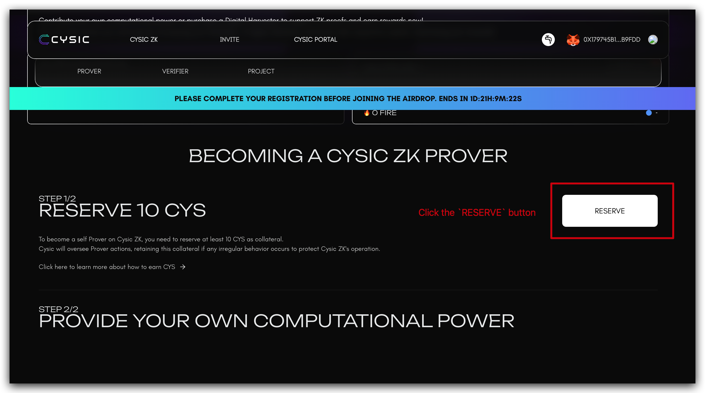
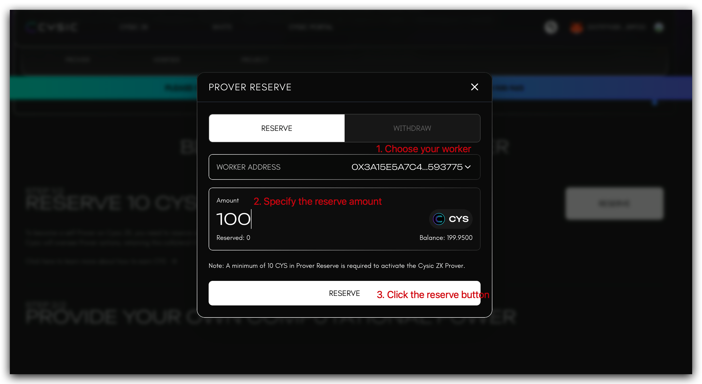

# How to Run a Prover Node

## 1. Background

ZK prover nodes are one of the critical roles in Cysic Network. Their job is to generate ZK proofs of various kinds, assigned by our partners and obtain Cysic Network credits as the rewards. Operating a prover node requires a solid understanding of DevOps and high-performance hardware.&#x20;

## 2. Hardware Requirements

Before proceeding, ensure your system meets the following minimum requirements:

* Basic understanding of command-line operations and Linux system administration
* Hardware specifications:
  * Random Access Memory (RAM): Minimum 64GB
  * Storage: Minimum 100GB of available disk space
  * Graphics Processing Unit (GPU): Minimum 16GB VRAM
  * Processor: 8 cores CPU with 64-bit architecture
* Reliable internet connection with stable low-latency access
* Supported operating system: Linux (Ubuntu 24.04 LTS or compatible distributions recommended)

### 3. Get Free RPC endpoint used by eth proof

1.  Go the [Alchemy](https://www.alchemy.com/) website to register a free RPC endpoint, sign in or register

    <figure><figcaption></figcaption></figure>
2.  Create a new app

    <div><figure><figcaption></figcaption></figure> <figure><figcaption></figcaption></figure> <figure><figcaption></figcaption></figure> <figure><figcaption></figcaption></figure></div>
3.  Got the RPC URL：copy the url

    <figure><figcaption></figcaption></figure>

### 4. Deploying the Prover Node

1. Launch your terminal application on Linux.
2.  Execute the following command, replacing `0x-Fill-in-your-reward-address-here` with your designated reward address:

    ```bash
    # replace 0x-Fill-in-your-reward-address-here to your reward address below

    curl -L https://github.com/cysic-labs/cysic-mainnet-scripts/releases/download/v1.0.0/setup_prover.sh > ~/setup_prover.sh && bash ~/setup_prover.sh 0x-Fill-in-your-reward-address-here Your_RPC_URL

    cd ~/cysic-prover/ && bash start.sh
    ```
3. Update the bid price field in the config.yaml file. You can adjust your **bid** price according to your machine price and reward policy to maximize your earnings.
   1. Lower the bid price to increase the likelihood of getting the prove task.
   2.  Raise the bid price to increase the reward for completing a prove task.


       <figure><figcaption></figcaption></figure>
4.  Start the Prover Node service:

    ```bash
    cd ~/cysic-Prover && bash start.sh
    ```

### 5. Post-Deployment Configuration

#### 5.1 Prover Node Initialization Output

Upon successful startup of the Prover Node using the `start.sh` script, you will observe terminal output similar to the following:

```bash
2025/12/08 02:52:27 start setup config
2025/12/08 02:52:27 start setup service
2025/12/08 02:52:27 start load secret file from path: ./data/assets
2025/12/08 02:52:27 file: data/assets/prover_0x179745B18af3975582078aa9B55802F9A9Db9fdD.key not exist, we will create it.
2025/12/08 02:52:27 your submit address mnemonic file is in: data/assets/prover_0x179745B18af3975582078aa9B55802F9A9Db9fdD.key, please keep it!!!
2025/12/08 02:52:27 your submit address mnemonic file is in: data/assets/prover_0x179745B18af3975582078aa9B55802F9A9Db9fdD.key, please keep it!!!
2025/12/08 02:52:27 your submit address mnemonic file is in: data/assets/prover_0x179745B18af3975582078aa9B55802F9A9Db9fdD.key, please keep it!!!
2025/12/08 02:52:27 send register info to server
2025/12/08 02:52:27 start setup job
2025/12/08 02:52:27 start firstTimeGetHWInfo
2025/12/08 02:52:27 try get prover id from chain
2025/12/08 02:52:27 received message:  {"code":0,"message":"your current worker address is: 0x3A15e5A7c4301a25Ce04025B523AaC792A593775","respType":0,"data":null}

2025/12/08 02:52:27 error when get prover from chain, prover: 0x3A15e5A7c4301a25Ce04025B523AaC792A593775, err: prover not found
2025/12/08 02:52:27 error when get prover id, err: prover not found
2025/12/08 02:52:27 received message:  {"code":0,"message":"","respType":1,"data":"eyJoZWFydGJlYXREdXJhdGlvbiI6MTV9Cg=="}

2025/12/08 02:52:27 received message:  {"code":0,"message":"please Reserve first","respType":0,"data":null}

2025/12/08 02:53:12 send heartbeat to server
2025/12/08 02:53:13 received message:  {"code":0,"message":"please Reserve first","respType":0,"data":null}

{"code":0,"message":"your current worker address is: 0x3A15e5A7c4301a25Ce04025B523AaC792A593775","respType":0,"data":null}

2025/12/08 02:53:13 error when unmarshal message, err:  invalid character '{' after top-level value
2025/12/08 02:53:27 try get prover id from chain
2025/12/08 02:53:28 success got prover info with address: 0x3A15e5A7c4301a25Ce04025B523AaC792A593775
2025/12/08 02:53:57 send heartbeat to server
2025/12/08 02:53:58 received message:  {"code":0,"message":"please Reserve first","respType":0,"data":null}

{"code":0,"message":"your current worker address is: 0x3A15e5A7c4301a25Ce04025B523AaC792A593775","respType":0,"data":null}
```

#### 5.2 Critical Post-Deployment Steps

After starting the Prover Node, complete the following mandatory steps:

1. **Secure Key Management**: Immediately backup all worker key files located in the `data/assets` directory. These keys are essential for node operation and reward claiming; store them in a secure, offline location.
2. **Node Registration**: Proceed to the Cysic Mainnet Website to reserve CYS tokens for your worker node, enabling it to participate in proof generation tasks.

#### 5.3 Reserving CYS for Your Worker Node

> A reserve of 1,000 CYS is required for each Prover Worker Node.

To activate your Prover Node, follow these steps to reserve CYS tokens:

1. **Access the Cysic Mainnet Portal**: Navigate to the official Cysic Mainnet Website: [https://app.cysic.xyz/prover](https://app.cysic.xyz/prover)
2.  **Authenticate Your Account**: Click the sign-in button and follow the prompts to authenticate.

    <figure><figcaption></figcaption></figure>
3.  **Connect Your Wallet**: Establish a connection between your wallet and the Cysic Mainnet Portal.

    <figure><figcaption></figcaption></figure>

    <figure><figcaption></figcaption></figure>

    <figure><figcaption></figcaption></figure>

    <figure><figcaption></figcaption></figure>


4.  **Connect Keplr Wallet**: Select the _CONNECT KEPLR_ button and confirm the connection request.

    <figure><figcaption></figcaption></figure>
5.  **Reserve CYS Tokens**: Scroll to the RESERVE CYS section, click the _RESERVE_ button, select your worker node from the dropdown menu, and specify the required amount of CYS tokens to reserve.

    <figure><figcaption></figcaption></figure>

    <figure><figcaption></figcaption></figure>
6.  **Verification of Activation**: After successfully reserving CYS tokens, your Prover Node terminal will display output similar to the following, indicating the node is ready to receive proof generation tasks:

    ```bash
    2025/12/08 02:58:27 send heartbeat to server
    2025/12/08 02:58:27 received message:  {"code":0,"message":"your current worker address is: 0x3A15e5A7c4301a25Ce04025B523AaC792A593775","respType":0,"data":null}
    ```

**Important Note**: Ensure your each Prover Node _worker address_ maintains a sufficient balance of CYS tokens to cover transaction fees when submitting proof generation results.


## Appendix

### (Optional) Nvidia 5090 Support

The Nvidia 5090 card is supported. If you launched the Prover prior to 2025-12-22 and encountered an error, you may use the commands below to update the binary to be compatible with the 5090 GPU. For users launching the Prover on or after 2025-12-22, this step is unnecessary, as the new binary has been incorporated into `setup_prover.sh`.<br>

```
curl -L https://github.com/cysic-labs/cysic-mainnet-scripts/releases/download/v1.0.0/moongate-server > ~/cysic-prover/host_cuda_prover
```

### (Optional) Convert Reward Address to Private Key

> **Warning:** Below command can convert the prover reward address key file to private key.
>
> This step is only needed if you want to use the private key for other operations. Don't share the private key with anyone.

```bash
cd ~/cysic-prover
curl -L https://github.com/cysic-labs/cysic-mainnet-scripts/releases/download/v1.0.0/reward_address_decryptor_prover.sh > reward_address_decryptor_prover.sh
bash reward_address_decryptor_prover.sh
```

Above command will do the following task:

* Download the decryptor script to the `~/cysic-prover` folder.
* Execute the decryptor script, the script will do the following steps:
  * Download the decryptor program to the `~/cysic-prover/data/assets/` folder.
  * Make the decryptor program executable.
  * Run the decryptor program(the program will try to decrypt the reward address key file in current folder and print the private key to the console. If you have other key files need to decrypt, please copy them to this folder and the program will decrypt them as well).

The output of the decryptor program will be similar to below:

```
read privatekey from current dir
found 1 privatekey file
==========================================
reward address: 0x6e1fC643be3fDBeA1d80BA7e6E373491246E60D6
	 privatekey: AAAAAAAAAAAAAAAAAAAAAAAAAAAAAAAAAAAAAAAAAAAAAAAAAAAAAAAAAAAAAAAA
==========================================
```
