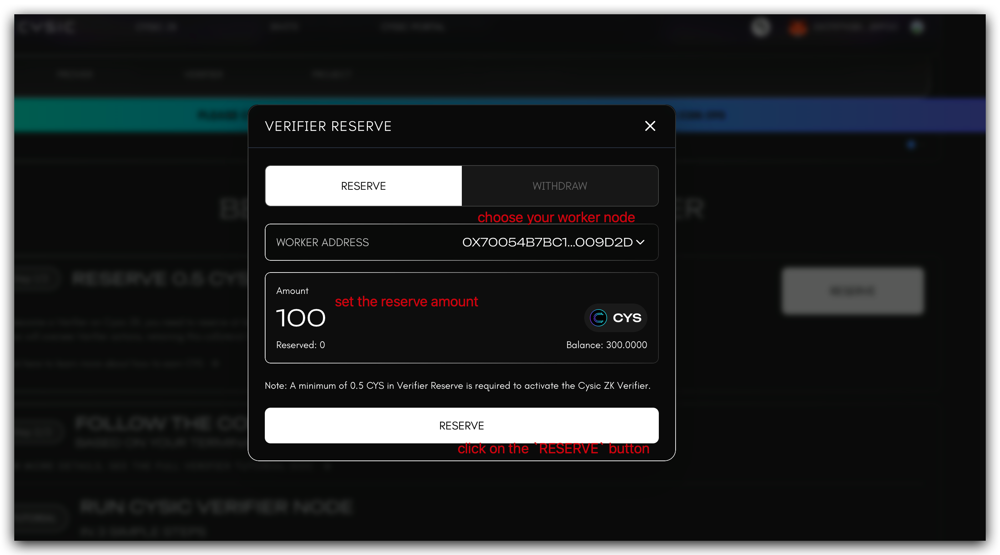

# How to Run a Verifier Node

### 1. Overview

ZK verifier nodes are one of the critical roles in Cysic Network. Their job is to verify the ZK proofs generated by the Prover Node, and obtain Cysic Network credits as the rewards. Operating a verifier node requires minimum understand of the DeeOps and requirement on the hardware.

### 2. Prerequisites

Before proceeding, ensure your system meets the following requirements:

* Basic understanding of command-line operations
* Reliable internet connection
* Compatible operating system (Linux, macOS, or Windows)

### 3. Deploying the Verifier Node

#### 3.1 Linux Installation

1. Launch your terminal application on Linux.
2.  Execute the following command, replacing `0x-Fill-in-your-reward-address-here` with your designated reward address:

    ```bash
    # Replace with your actual reward address
    curl -L https://github.com/cysic-labs/cysic-mainnet-scripts/releases/download/v1.0.0/setup_linux.sh > ~/setup_linux.sh && bash ~/setup_linux.sh 0x-Fill-in-your-reward-address-here
    ```
3.  Start the Verifier Node service:

    ```bash
    cd ~/cysic-verifier && bash start.sh
    ```

#### 3.2 macOS Installation

1. Open your terminal application on macOS.
2.  Run the following command, substituting `0x-Fill-in-your-reward-address-here` with your reward address:

    ```bash
    # Replace with your actual reward address
    curl -L https://github.com/cysic-labs/cysic-mainnet-scripts/releases/download/v1.0.0/setup_mac.sh > ~/setup_mac.sh && bash ~/setup_mac.sh 0x-Fill-in-your-reward-address-here
    ```
3.  Initiate the Verifier Node service:

    ```bash
    cd ~/cysic-verifier && bash start.sh
    ```

#### 3.3 Windows Installation

1. Open PowerShell as an administrator on Windows.
2.  Execute the following commands sequentially, replacing `0x-Fill-in-your-reward-address-here` with your reward address:

    ```powershell
    # Replace with your actual reward address
    cd $env:USERPROFILE
    Invoke-WebRequest -Uri "https://github.com/cysic-labs/cysic-mainnet-scripts/releases/download/v1.0.0/setup_win.ps1" -OutFile "setup_win.ps1"
    .\setup_win.ps1 -CLAIM_REWARD_ADDRESS "0x-Fill-in-your-reward-address-here"
    ```
3.  Start the Verifier Node service:

    ```powershell
    cd ~/cysic-verifier && bash start.sh
    ```

### 4. Post-Deployment Configuration

#### 4.1 Verifier Node Initialization Output

Upon successful startup of the Verifier Node using the `start.sh` script, you will observe terminal output similar to the following:

```bash
2025/12/07 10:02:40 start setup config
2025/12/07 10:02:40 always submit result pass: true
2025/12/07 10:02:40 start setup service
2025/12/07 10:02:40 start load default sender
2025/12/07 10:02:40 start load secret file from path: ./data/assets
2025/12/07 10:02:40 file: data/assets/0x179745B18af3975582078aa9B55802F9A9Db9fdD.key not exist, we will create it.
2025/12/07 10:02:40 your worker address mnemonic file is in: data/assets/0x179745B18af3975582078aa9B55802F9A9Db9fdD.key, please keep it!!!
2025/12/07 10:02:40 your worker address mnemonic file is in: data/assets/0x179745B18af3975582078aa9B55802F9A9Db9fdD.key, please keep it!!!
2025/12/07 10:02:40 your worker address mnemonic file is in: data/assets/0x179745B18af3975582078aa9B55802F9A9Db9fdD.key, please keep it!!!
2025/12/07 10:02:42 send register info to server
2025/12/07 10:02:42 received message:  {"code":0,"message":"your current worker address is: 0x70054B7BC1a25D3fff3eE9A95Cb13CD611009D2d","respType":0,"data":null}

2025/12/07 10:02:42 received message:  {"code":0,"message":"","respType":1,"data":"eyJoZWFydGJlYXREdXJhdGlvbiI6MTV9Cg=="}
```

#### 4.2 Critical Post-Deployment Steps

After starting the Verifier Node, complete the following mandatory steps:

1. **Secure Key Management**: Immediately backup all worker key files located in the `data/assets` directory. These keys are essential for node operation and reward claiming; store them in a secure, offline location.
2. **Node Registration**: Proceed to the Cysic Mainnet Website to reserve CYS tokens for your worker node, enabling it to participate in proof verification tasks.

#### 4.3 Reserving CYS for Your Worker Node

To activate your Verifier Node, follow these steps to reserve CYS tokens:

1. **Access the Cysic Mainnet Portal**: Navigate to the official Cysic Mainnet Website: [https://app.cysic.xyz/verifier](https://app.cysic.xyz/verifier)
2.  **Authenticate Your Account**: Click the sign-in button and follow the prompts to authenticate.

    <figure><figcaption></figcaption></figure>
3.  **Connect Your Wallet**: Establish a connection between your wallet and the Cysic Mainnet Portal.<br>

    <figure><figcaption></figcaption></figure>

    <figure><figcaption></figcaption></figure>

    <br>

    <figure><figcaption></figcaption></figure>

    <figure><figcaption></figcaption></figure>
4.  **Connect Keplr Wallet**: Select the _CONNECT KEPLR_ button and confirm the connection request.

    <figure><figcaption></figcaption></figure>
5.  **Reserve CYS Tokens**: Scroll to the RESERVE CYS section, click the _RESERVE_ button, select your worker node from the dropdown menu, and specify the required amount of CYS tokens to reserve.

    <figure><figcaption></figcaption></figure>

    <figure><figcaption></figcaption></figure>
6.  **Verification of Activation**: After successfully reserving CYS tokens, your Verifier Node terminal will display output similar to the following, indicating the node is ready to receive verification tasks:

    ```bash
    2025/12/08 00:55:12 send heartbeat to server
    2025/12/08 00:55:12 received message:  {"code":0,"message":"","respType":1,"data":"eyJoZWFydGJlYXREdXJhdGlvbiI6MTV9Cg=="}
    ```

**Important Note**: Ensure your Verifier Node maintains a sufficient balance of CYS tokens to cover transaction fees when submitting verification results.
